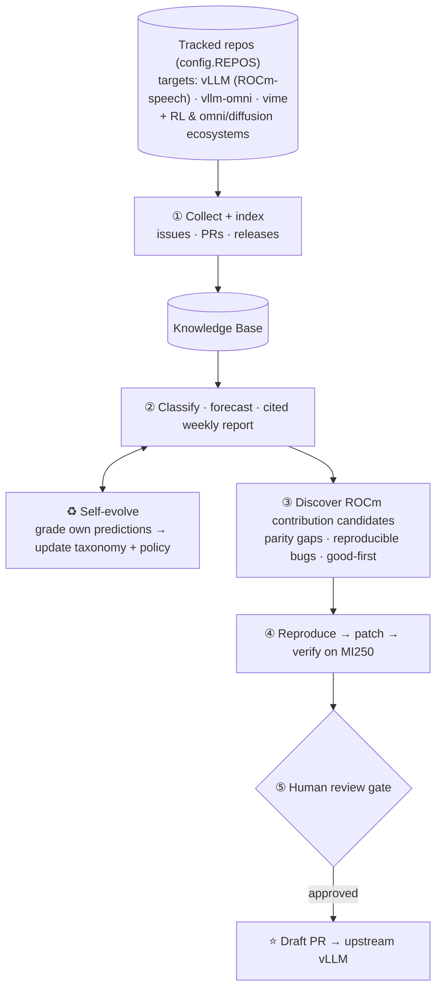

# vllm-forager

> autonomous vLLM/ROCm contributor — continuously forages for contribution opportunities, fixes them, and gives back.

An **autonomous agent that continuously advances vLLM on ROCm (MI250)**.
It continuously tracks issues and PRs across the inference-serving ecosystem (vLLM · SGLang · NVIDIA Dynamo · llm-d)
to map out the direction of the inference market and its key techniques, **grades its own predictions to evolve its
tracking criteria**, and uses those signals to run an always-on, self-improving loop that goes from
**discovering vLLM (ROCm) contribution candidates → generating and testing patches → human review → PR**.

> Status: **M0 (bootstrapping)** — collector skeleton stage.

## How it works



⭐ is the **upstream-vLLM draft-PR agent** — the product's ultimate output — reachable only after a patch is
verified on real **MI250** hardware and a **human approves**; nothing goes upstream automatically. The ♻️ loop is
the differentiator: the agent grades its own past predictions to keep improving its taxonomy + policy. Full
architecture, including the dev-loop / self-build view, is in
[`docs/PLAN.md`](docs/PLAN.md#architecture-at-a-glance) — see its
[Tracked repos](docs/PLAN.md#tracked-repos-configrepos) section for the full, generated
`config.REPOS` list.

## Why ROCm

Available hardware is 3x MI250 (AMD Instinct, ROCm). vLLM's ROCm path is less mature than CUDA, so it has more
unresolved gaps and bugs, and many issues are left unaddressed because there's no AMD hardware to reproduce them on
→ **having real hardware is both the barrier to entry and the edge.**

- Agent runtime: **CPU is enough** (no GPU needed).
- MI250 is used **only for building/testing vLLM and reproducing/verifying ROCm bugs.**

## Quick start

```bash
# 1) Virtual environment
python -m venv .venv && source .venv/bin/activate
pip install -r requirements.txt

# 2) Configure GitHub token (avoid rate limits + access private repos)
cp .env.example .env
# open .env and fill in GITHUB_TOKEN (PAT with repo, read access)

# 3) Run the minimal collector once → generates data/*.jsonl
python -m src.collector

# 4) Incremental collection (only items updated since last run, based on state)
python -m src.collector
```

## Repo structure

```
vllm-forager/
├── README.md · CLAUDE.md            # CLAUDE.md = auto-loaded rules/pointers for every session
├── requirements.txt · requirements-dev.txt · pyproject.toml · .pre-commit-config.yaml · pytest.ini · conftest.py · .env.example · setup.sh
├── .claude/
│   ├── settings.json                # permissions allowlist (denies `gh pr merge`)
│   └── commands/                    # dev-loop.md · collect-loop.md  (agent loop skills)
├── .github/
│   ├── workflows/                   # ci.yml (merge gate) · notify-pr.yml (ntfy on PR open/merge)
│   └── PULL_REQUEST_TEMPLATE.md
├── docs/
│   ├── PLAN.md · DEVPLAN.md · CONTEXT.md · SURVEY_RSI.md · IDEAS.md · RUNBOOK.md · CONTRIBUTING.md
│   ├── design/                      # report-tree-mockup.html (dashboard design spec)
│   └── research/                    # cost-tracking.md (per-agent cost tooling research)
├── src/
│   ├── config.py                    # tracked repos (targets + ecosystem, by domain/role) + cadence + hints
│   ├── llm.py                       # pluggable LLM wrapper (claude_cli / claude_api / local vLLM) + cost meta
│   ├── collector.py · audit.py                     # data plane: collect + data-quality guardrail
│   ├── embed.py · taxonomy.py · policy.py          # KB: vectors · versioned taxonomy/policy
│   ├── trends.py · rag_eval.py                     # trend series · RAG-trust guardrail
│   ├── parity.py · novelty.py · llm_bandit.py      # parity matrix · dedup · cost-aware provider bandit
│   ├── runner.py · repro.py · engineer.py          # contribution: MI250 run · repro · patch loop
│   ├── self_review.py · gate.py                    # ensemble self-review · fork-first human gate
│   ├── pr_profile.py · pr_author.py · pr_quality.py · review_loop.py   # maintainer-grade PR + review loop
│   ├── agents/                      # LLM agents: analyst · forecaster · reporter(_v1) · summarizer · grader · policy_update · curator · scout
│   ├── store/                       # pluggable KB: base · jsonl_store · firestore_store · migrate
│   └── analyze.py · forecast.py · report.py · grade.py · candidates.py · stats.py   # CLI entrypoints
├── dashboard/                       # read-only web operator console (render · server · __main__)
├── scripts/
│   ├── wait-merge.sh · notify.sh    # poll PR until merged + ntfy phone push
│   ├── collect.sh · triage.sh       # scheduled collect + human-gated self-heal
│   └── devplan-link.sh              # SHA-pinned DEVPLAN permalink for PR bodies
├── tests/                           # 41 offline/deterministic tests (test_<module>.py; live ones integration-marked)
└── data/                            # collection output + reports/attempts (gitignored)
```

## Next steps

Work the checklist in **`docs/DEVPLAN.md`** — it's the resumable Milestone → to-do list, and every todo names a
test. Find the first unchecked box and continue; a box is checked only when its test passes.

```bash
pip install -r requirements-dev.txt
python -m pytest        # offline suite — keep it green
```

See `docs/PLAN.md` for the architecture and `docs/CONTEXT.md` for the reasoning behind decisions.

## Running the agents (how to start the workflow)

The agents run on **ce-master** and are **human-gated** — they open PRs; **you merge**. Your **Mac runs no
agent**; it's the control plane (review + merge PRs on GitHub).

**Autonomous developer** — builds the DEVPLAN, one todo per PR:

```bash
ssh ce-master
tmux new -s dev                          # persistent; survives disconnects
cd vllm-forager && source .venv/bin/activate
claude                                    # then: Shift+Tab (Accept-Edits) → /dev-loop
```

`/dev-loop` loops: first unchecked DEVPLAN todo → branch → implement + test → `pytest`/`pre-commit` green → open
PR → `/code-review --comment` → poll until **you** merge → next todo, pausing at each milestone boundary. It never
self-merges. (Omit `/dev-loop` to drive a manual, step-by-step session.)

**Data collector** — runs the product on a schedule. It also does `git checkout`/branches, so give it its **own
clone** (never collides with `/dev-loop`) and point both clones at one shared data dir:

```bash
# on ce-master, one-time
mkdir -p ~/forager-data
gh repo clone HAN-oQo/vllm-forager ~/vllm-forager-collect
cd ~/vllm-forager-collect
python -m venv .venv && source .venv/bin/activate && pip install -r requirements-dev.txt
cp ~/vllm-forager/.env .env
echo "FORAGER_DATA_DIR=$HOME/forager-data" >> .env                 # share data
echo "FORAGER_DATA_DIR=$HOME/forager-data" >> ~/vllm-forager/.env  # dev clone too
```

Then run the collect agent in that clone:

```bash
cd ~/vllm-forager-collect && tmux new -s collect
claude                                    # then: Shift+Tab (Accept-Edits) → /loop 6h /collect-loop
```

`/collect-loop` each cycle: collect → report counts, or on failure diagnose (transient → wait; real bug → fix PR,
never merges). **Separate clones = no git collision; shared `FORAGER_DATA_DIR` = shared data.** (`docs/RUNBOOK.md`
also covers a simpler cron + `scripts/collect.sh` fallback.)

Watch or steer either: `ssh ce-master && tmux attach -t dev`. Full operator guide: **`docs/RUNBOOK.md`**.
